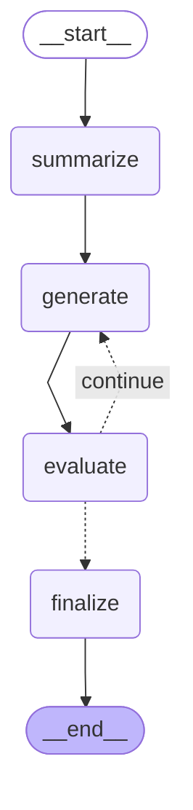

# Feature Discovery Workflow

```mermaid
---
config:
  flowchart:
    curve: linear
---
graph TD;
	__start__([<p>__start__</p>]):::first
	summarize(summarize)
	generate(generate)
	evaluate(evaluate)
	finalize(finalize)
	__end__([<p>__end__</p>]):::last
	__start__ --> summarize;
	evaluate -.-> finalize;
	evaluate -. &nbsp;continue&nbsp; .-> generate;
	generate --> evaluate;
	summarize --> generate;
	finalize --> __end__;
	classDef default fill:#f2f0ff,line-height:1.2
	classDef first fill-opacity:0
	classDef last fill:#bfb6fc

```
